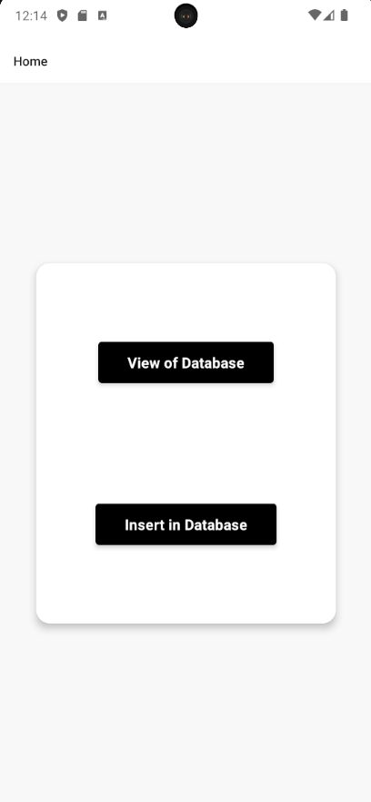

# React Native 📱💻

Welcome to this folder dedicated to my sketches in React Native! 🎨📝

This folder gathers a variety of projects, code examples, and practical exercises in React Native.

## 📚 Content

- **Component Examples**: Various examples of React Native components, such as views, buttons, lists, and more.
- **Advanced Features**: Exploration of advanced features such as navigation, state management, and more.
- **Integrations**: Examples of integrations with external APIs.

## 🎥 Demo

<iframe src="https://player.vimeo.com/video/https://youtu.be/BEHCjWC9OX4" width="640" height="360" frameborder="0" allow="autoplay; fullscreen; picture-in-picture" allowfullscreen></iframe>

## 🌱 Possible Improvements

- **API Usage**: Explore integrating data from external APIs to enhance functionality.
- **Non-Local Database**: Integrate a non-local database.
- **Element Deletion**: Functionality for deleting elements.
- **Tests**: Some test scripts and examples of automated tests for your React Native applications.

## 🐞 Known Bug

Deleting the database and recreating it with the same name does not change the displayed results. New information is displayed in addition to the information that should have been deleted.
